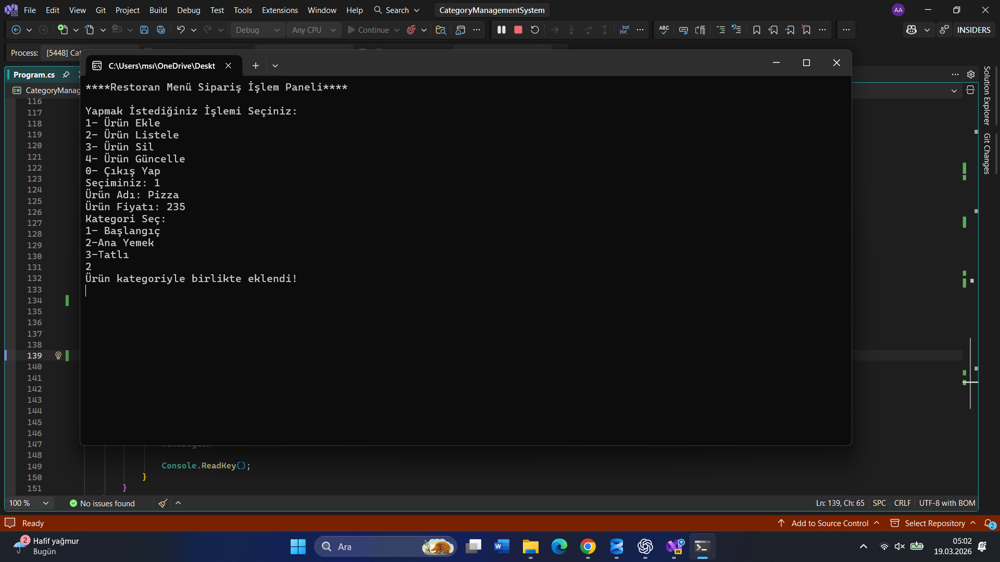
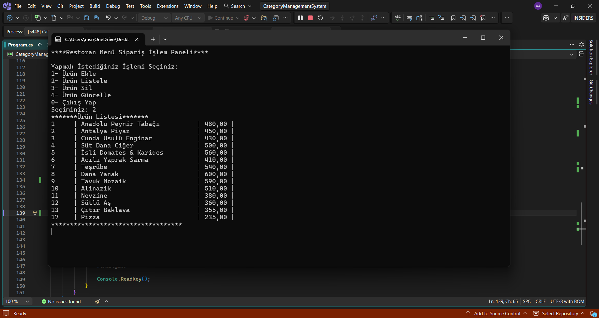
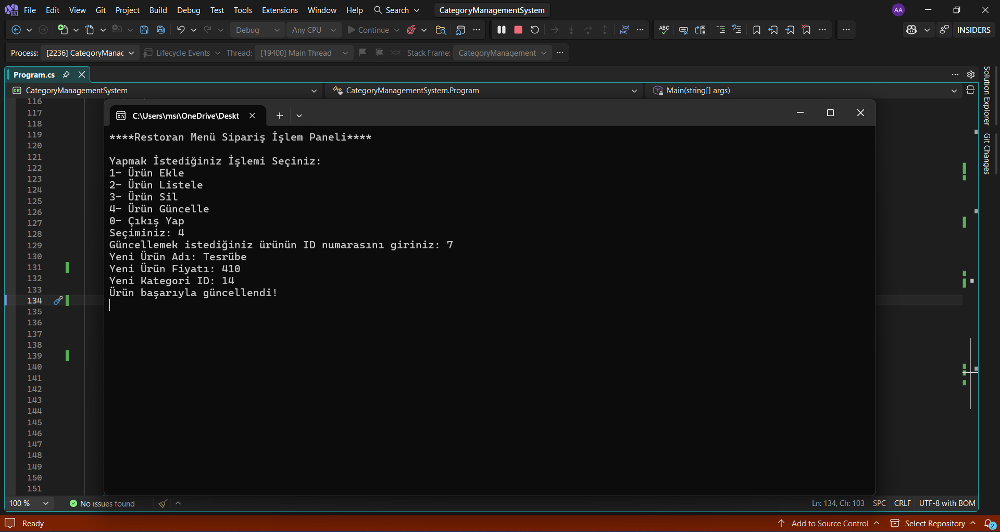
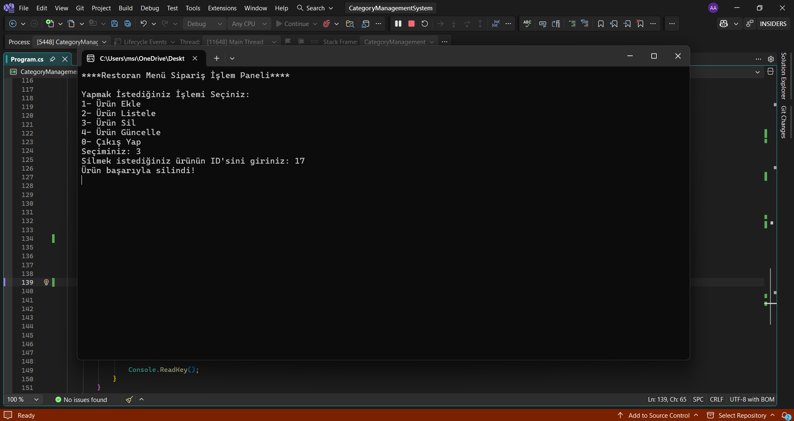

🍽️ Restaurant Menu Management System

This project is a console-based application developed using C# and SQL Server.
It allows users to manage restaurant menu items with category-based structure and CRUD operations.

🚀 Features

Add new products

List all products

Delete products

Update product information

Category-based menu system (Starter, Main Course, Dessert)

🛠️ Technologies Used

C#

.NET Console Application

SQL Server

ADO.NET

## 📸 Console Preview

### Add Product

### List Products

### Update Product

### Delete Product

## 🧠 What I Learned

- Building CRUD operations with SQL Server  
- Using ADO.NET for database connectivity  
- Designing console-based user interfaces  
- Managing relational data (products & categories)  

## ⚙️ How to Run

1. Clone this repository  
2. Open the project in Visual Studio  
3. Update the SQL connection string if needed  
4. Run the project  

## 📌 Notes

- The project uses a local SQL Server database  
- Connection string may need to be updated depending on your system  

## 👩‍💻 Developer

Aleyna

Aleyna

